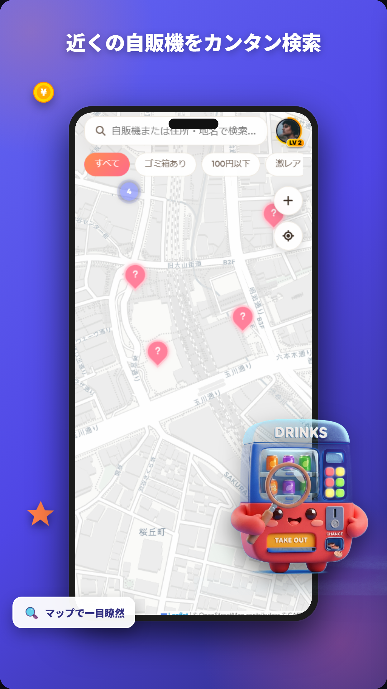
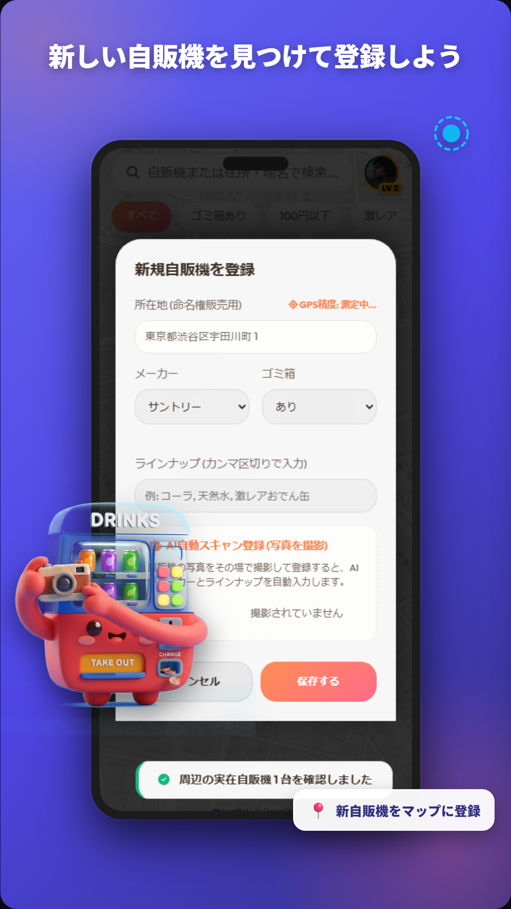
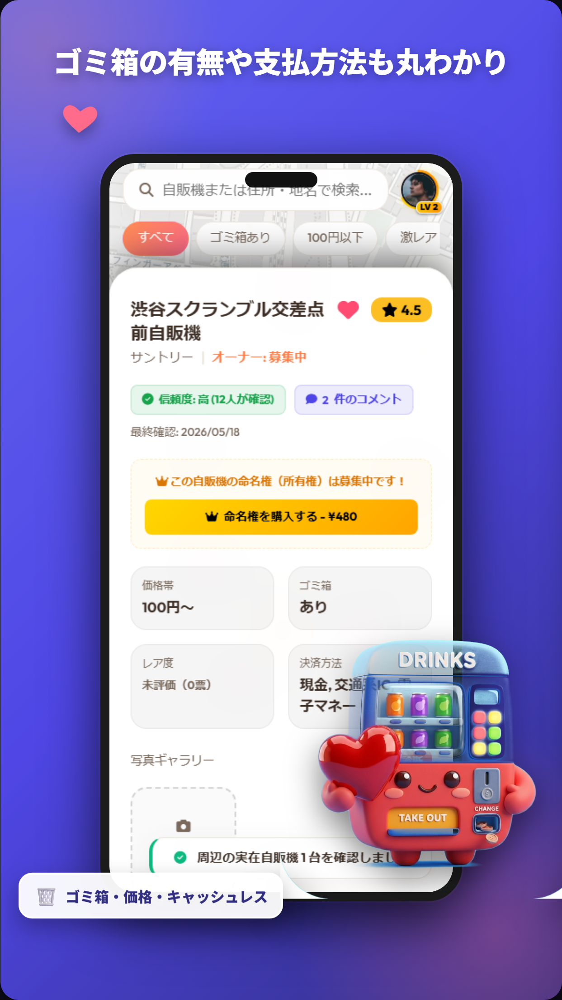
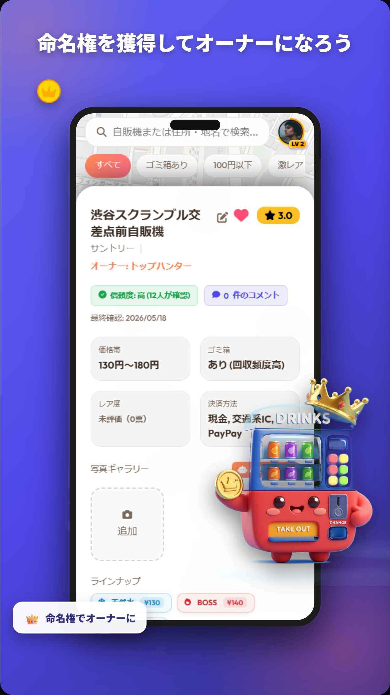
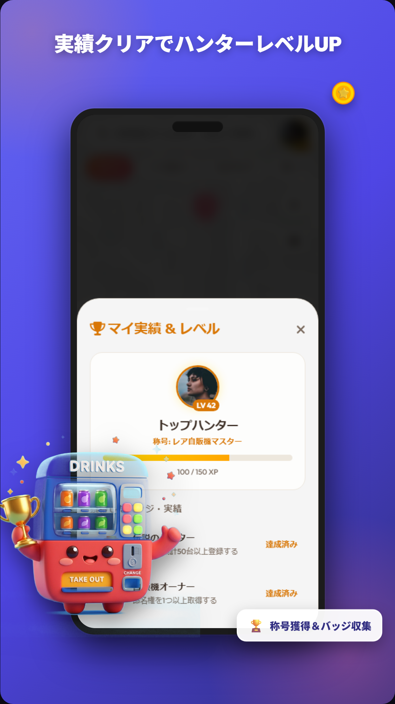

# マイジハ (MyJiha) アプリ機能紹介＆プロモーションガイド

マイジハ（旧 VendiMap）は、全国の自動販売機をユーザー全員で発見・共有し、コレクションや命名権の取引を楽しむことができる、位置情報＆ゲーミフィケーション型自販機探索アプリです。

スマホアプリストア（Google Play Store / App Store）掲載用および広告プロモーション向けに、**実際のアプリ画面と公式3Dマスコットを用いたプロモーション用モックアップ画像**を作成しました。以下に各主要機能の解説とともにご紹介します！

---

## 🗺️ 1. 近くの自販機をカンタン検索 (マップ＆検索機能)

アプリを起動すると、目に優しいウォームクリーム色の明るいマップ（ライトモード）と、ぷにぷにとした丸っこいクレイ調のUIが表示されます。
検索バーでは、ひらがなやローマ字での曖昧入力（例：「こーく」➜「コカ・コーラ」）に対応したスマート検索や、ゴミ箱の有無などのタグ検索が可能です。

- **検索機能のポイント**: ひらがな・カタカナ・ローマ字対応の曖昧ブランド検索、最寄りの自販機からの距離順ソート、ゴミ箱や格安（100円以下）タグによる絞り込み。

---

## 📸 2. 写真からAIが販売ドリンクを特定 (画像解析スキャン)

荒らしや古い情報の投稿を防ぐため、写真のライブラリアップロードを完全に排除。**「その場でのリアルタイム背面カメラ撮影」**のみを強制する安全仕様です。
カメラ撮影された自販機の画像は、Gemini AIによってスキャンされ、飲料ラインナップ、メーカー名、価格帯、売り切れ状況が自動で判別・登録されます。

- **画像解析のポイント**: 自販機を写真に撮るだけで、何が売っているか（ラインナップ）をAIが自動判別してデータベースへ即座に反映します。

---

## 🗑️ 3. ゴミ箱の有無や支払方法も丸わかり (詳細パネル機能)

自販機ピンをタップするとスライドインする詳細パネルでは、自販機に関するすべての重要スペックが一目で確認できます。
「ゴミ箱の有無」「販売されているドリンクの価格帯」「SuicaやQRコードなどのキャッシュレス決済対応」など、買いたい時に本当に知りたい情報がすべて揃っています。

- **詳細情報のポイント**: ゴミ箱あり、キャッシュレス対応、お気に入り（ハートマーク 💖）など、プレイヤーが現場で重宝する情報を網羅しています。

---

## 👑 4. 命名権を獲得してオーナーになろう (所有権＆リネーム)

Stripe決済を通して自販機の「永続命名権（オーナー権）」を購入することができます。
自分が所有者となった自販機は、マップ上でピンの上に **王冠（👑）マークがフワフワと浮遊し、プレミアムゴールドのオーラ** がアニメーションで明滅します！また、オーナーは詳細パネルから自販機の名前をいつでも自由に変更可能です。

- **所有権のポイント**: ログインするだけで所有権やアクティベーション状況が自動で同期されます。「マイ自販機」フィルターをオンにすれば、自分が所有する自販機だけをマップに瞬時に絞り込めます。

---

## 🏆 5. 実績クリアでハンターレベルUP (ゲーミフィケーション)

自販機を発見したり、クチコミを投稿したりするとXP（経験値）が貯まり、アバター周囲 of リングメーターが伸びてレベルアップします！
スマホ実機での縦長画面に最適化された実績ダッシュボードでは、獲得したバッジや称号、未達成条件を高コントラストかつクリアに確認できます。

- **ゲーミフィケーションのポイント**: 3回未満しか投票されていない自販機は「?」マーク付きのパープルピンで明滅し、他のプレイヤーに「未開拓エリアの評価」を促すゲーム性を持たせています。
